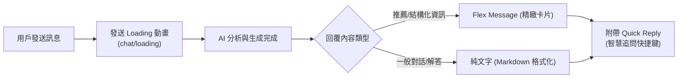
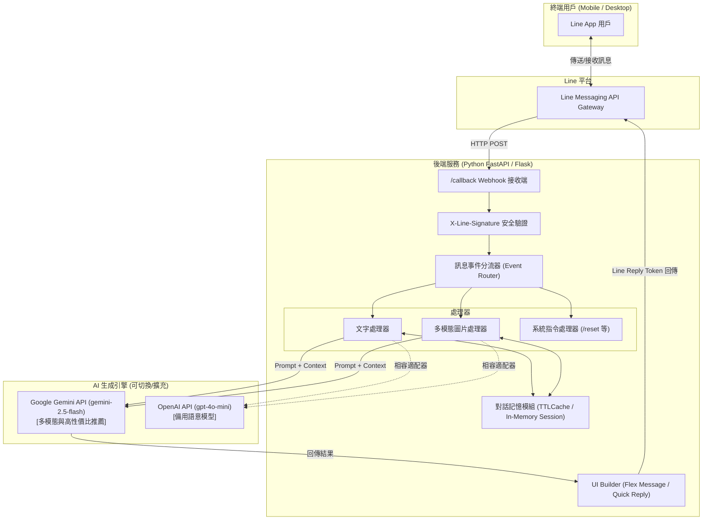
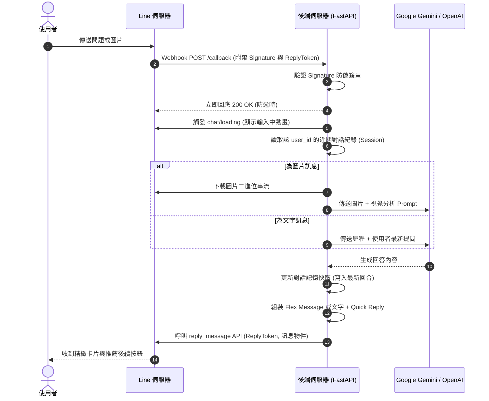
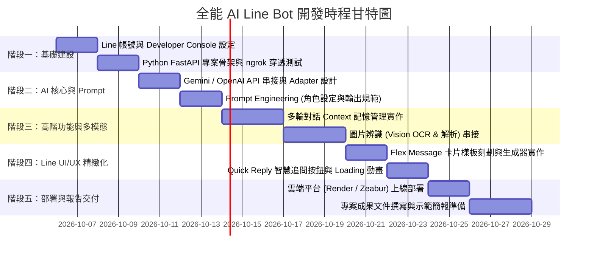

# my-project# 專案計畫書：全能 AI 全天候個人萬能助理 Line Bot (Universal AI Assistant)

> **專案代號**：`OmniLine-AI`  
> **核心願景**：打通用戶最慣用的 Line 介面，打破傳統機器人單一功能與死板選單的限制，打造隨時隨地「有求必應」的跨領域 7x24 個人智慧助理。

---

## 一、 專案背景與核心價值 (Background & Value Proposition)

### 1.1 背景與問題意識
現代人面臨繁雜的生活與工作資訊處理需求，常常需要為了特定功能在多個 App 或網頁之間切換（如：開瀏覽器查常識、開翻譯軟體潤飾英文、開美食地圖查店家、開筆記軟體寫摘要）。這造成了顯著的「應用切換摩擦（App Fatigue）」。

### 1.2 核心價值主張
* **單一入口，跨領域萬能**：將 AI 深度整合進台灣滲透率最高的 Line 通訊軟體，無需額外下載 App，即可在單一聊天室中解決生活與工作上的全方位疑難雜症。
* **從被動式查表升級為生成式互動**：摒棄傳統 Line 官方帳號的死板關鍵字與樹狀層級，透過 LLM 的語意理解能力，直接提供量身訂做的即時解答。

---

## 二、 目標受眾與典型使用情境 (Target Audience & Scenarios)

### 2.1 目標受眾 (Target Audience)
* **大學生族群**：課業報告撰寫、外語論文/作文地道潤飾、複雜概念簡明摘要、生活聚會推薦。
* **職場上班族**：商務 Email 與對外文案修訂、跨領域專業知識速查、會議要點整理、出差旅遊周邊推薦。

### 2.2 核心使用場景與互動範例

| 場景類別 | 使用者輸入範例 (User Input) | AI 處理邏輯與輸出形式 | Line UI 呈現方式 |
| :--- | :--- | :--- | :--- |
| **文字寫作與潤飾** | 「幫我把這段英文改得更地道：*I want to know if you have time tomorrow to meet me.*」 | 分析文法與語境，提供「商務正式」與「休閒口語」兩種版本，並附上修訂原因與解析。 | **Flex Message 卡片**（左右/上下對照欄位） |
| **生活與周邊推薦** | 「台北車站附近有什麼推薦的平價咖啡廳？要有插座的。」 | 彙整精選 2~3 間符合條件的店家，包含特色、大約價位、距離資訊與推薦亮點。 | **Flex Message 輪播卡片** + **Quick Reply**（推薦追問按鈕） |
| **照片視覺辨識** | *[傳送一張包含外文產品標籤或課堂白板筆記的照片]* | 多模態 Vision 提取圖中文字（OCR），進行語意解析並條列出核心重點與中文翻譯。 | 結構化文字回覆 + Quick Reply 延伸動作 |
| **多輪連續追問** | 接續前文詢問：「那第一間咖啡廳走路過去要多久？」 | 讀取對話歷程（Context），精準理解「第一間」指涉的店家並進行連貫回答。 | 順暢的多輪文字互動 |

---

## 三、 Line 專屬互動體驗設計 (Line UX/UI Design)

為了讓使用者感受到「現代、專業且流暢」的助理體驗，本專案深度整合 Line Messaging API 的專屬互動元件：

1. **Flex Message（精美卡片）**：
   * 用於呈現「多選項推薦（如美食/咖啡廳）」、「中英文對照翻譯卡」以及「系統歡迎指引」，大幅超越純文字訊息的閱讀體驗。
2. **Quick Reply（快速回應按鈕）**：
   * 位於輸入框上方的即時按鈕。例如回答完咖啡廳後，自動帶出：
     * `🧭 查看地圖`
     * `☕ 推薦菜單`
     * `🔄 換別間試試`
     * `🧹 清除對話記憶`
3. **Loading Animation（等待狀態提示）**：
   * 在後端呼叫 AI 運算的 1~3 秒內，向使用者顯示「正在輸入中...」動畫，徹底消除使用者以為當機的焦慮感。

---

## 四、 系統架構與資料流程 (Architecture & Data Flow)

### 4.1 系統架構圖 (Architecture Topology)

### 4.2 訊息處理時序圖 (Sequence Diagram)

---

## 五、 技術選型評估與依據 (Technology Stack)

| 維度 | 選定技術 | 備選方案 | 決策依據與架構考量 |
| :--- | :--- | :--- | :--- |
| **開發語言** | **Python 3.10+** | Node.js | Python 為 AI 領域第一語言，SDK 最新且具備豐富的文字與影像處理庫。 |
| **後端框架** | **FastAPI** | Flask | **推薦 FastAPI**：具備高併發原生 `async/await`，適合處理多使用者的 Webhook 請求；若課程限定同步或簡單範例，可無痛降級為 **Flask**。 |
| **Line SDK** | `line-bot-sdk` v3 | v2 (舊版) | 使用官方最新 v3 架構，支援標準 WebhookParser 與更彈性的 Messaging API 客戶端。 |
| **主選 AI 模型** | **Google Gemini 2.5 Flash** | OpenAI GPT-4o-mini | **推薦 Gemini**：免費額度寬裕、處理速度極快、原生多模態 Vision 辨識能力頂尖。專案將設計 **Adapter Pattern**，未來隨時可切換 OpenAI。 |
| **會話記憶機制** | **In-Memory TTLCache** | Redis / SQLite | 實作輕量字典快取，以 `user_id` 為鍵值儲存最近 5~10 回合對話，設置 15 分鐘 TTL 自動釋放記憶體，架構簡潔且無需維護複雜資料庫。 |
| **本機測試** | **ngrok** | Localtunnel | 業界標準本機穿透工具，能秒級產生 HTTPS 網址供 Line Webhook 綁定除錯。 |
| **雲端部署** | **Zeabur / Render** | Railway / Heroku | 支援 GitHub 連動自動部署、免費/低門檻、自動配置 SSL 憑證。 |

---

## 六、 專案里程碑與開發時程 (Milestones & Roadmap)

---

## 七、 系統邊界、異常處理與安全性 (Robustness & Security)

> [!IMPORTANT]
> **關鍵設計防護**：
> 1. **Line 1 秒回應機制 (防 Webhook 重送)**：Line 伺服器要求 Webhook 發送後必須在極短時間內收到 `200 OK`，否則會重試。後端採用非同步協程（Async Task）或立即返回機制，避免 AI 生成時間過長導致重複回應。
> 2. **Token 與 Key 安全防護**：嚴格實施環境變數管理（`.env`），不得將 `LINE_CHANNEL_SECRET`、`LINE_CHANNEL_ACCESS_TOKEN`、`GEMINI_API_KEY` 等敏感憑證簽入版本控制。
> 3. **安全簽章驗證**：所有進入 `/callback` 的請求皆強制通過 `X-Line-Signature` 雜湊比對，防止惡意請求偽造。
> 4. **字數與成本熔斷**：限制每次對話歷程長度與輸出上限，避免無限輪次造成 Token 消耗爆炸。

---

## 八、 作業成果評分亮點 (Academic & Presentation Highlights)

1. **切中實務痛點**：明確鎖定大學生與上班族的「英文潤飾」、「美食/店家推薦」與「圖文快析」，應用場景生活化且說服力強。
2. **頂級 UI/UX 實踐**：超越一般只有文字的陽春機器人，完整實踐 **Flex Message 精緻卡片** 與 **Quick Reply 導引按鈕**，視覺效果極具展演優勢。
3. **多模態前瞻架構**：不僅支援純文字，更具備即拍即問的視覺多模態能力。
4. **健全的工程設計**：包含安全簽章防護、對話記憶過期回收機制、非同步處理與雲端自動化部署規格。
# 專案計畫書：全能 AI 全天候個人萬能助理 Line Bot (Universal AI Assistant)

> **專案代號**：`OmniLine-AI`  
> **核心願景**：打通用戶最慣用的 Line 介面，打破傳統機器人單一功能與死板選單的限制，打造隨時隨地「有求必應」的跨領域 7x24 個人智慧助理。

---

